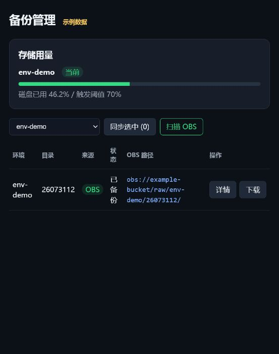
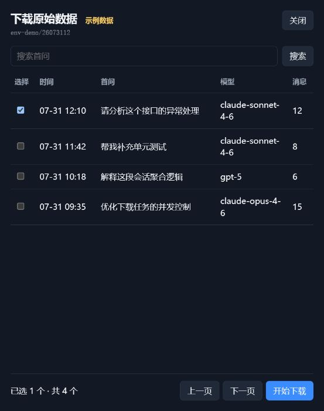

# OBS 关键原始数据下载

## 1. 功能说明

该功能用于从 OBS 备份中按会话选择原始数据，只下载能够代表该会话的关键文件。

- 入口位于“备份管理”页面每条 OBS 备份记录的“下载”按钮；
- 点击后读取该 OBS 目录的索引并生成会话列表；
- 用户勾选会话，数据由服务器上的 obsutil 下载到本地；
- 不下载整个目录，不生成 ZIP，也不直接下载到浏览器。

## 2. 页面效果

### 2.1 下载入口

只有已经存在 OBS 备份的记录才显示“下载”按钮。



### 2.2 会话选择

点击“下载”后，可以按首问搜索、分页查看并跨页勾选会话。点击“开始下载”后，页面轮询显示文件数量进度和服务器保存路径。



## 3. 核心实现

```text
用户点击“下载”
  ↓
根据 dir_path 从备份数据库取得 obs_path
  ↓
从 OBS 下载 session_index.jsonl
  ↓ 不存在时
回退下载 index.jsonl 并聚合会话
  ↓
返回会话摘要和 session_id
  ↓
用户提交选中的 session_id
  ↓
服务端生成关键文件清单
  ↓
obsutil 逐个下载对象到服务器
```

### 3.1 会话识别

优先使用 `session_index.jsonl`。它已经将多次请求聚合为会话，服务只需要从每个会话的 `trace_list` 中选择最合适的一条轨迹。

如果只有 `index.jsonl`，则使用以下键临时聚合：

```text
api_key + (q1_hash 或 chain_key 或文件名)
```

其中 `api_key` 只在服务端参与分组，不返回前端。

### 3.2 关键轨迹选择

同一会话的候选请求按以下优先级选择：

```text
请求成功 > 消息数量更多 > 时间更新
```

因此不能简单认为“最后一个文件一定最有用”。最后一次请求可能失败，此时会优先选择此前内容最完整的成功请求。

### 3.3 关键文件选择

| 数据格式 | 下载内容 |
|---|---|
| native：`xxx-req.json` | `xxx-req.json` 和 `xxx-res.json` |
| new-api：请求响应合并文件 | 索引指向的一个 JSON 文件 |

当前不下载 `headers.json`。

## 4. 数据例子

### 4.1 index.jsonl 原始数据

下面三行属于同一个会话：

```jsonl
{"ts":"2026-07-31_12-00-00_001","api_key":"team-a","q1_hash":"q1-abc","req_file":"t1-req.json","msg_count":2,"success":true}
{"ts":"2026-07-31_12-05-00_002","api_key":"team-a","q1_hash":"q1-abc","req_file":"t2-req.json","msg_count":8,"success":true}
{"ts":"2026-07-31_12-10-00_003","api_key":"team-a","q1_hash":"q1-abc","req_file":"t3-req.json","msg_count":12,"success":false}
```

聚合键为：

```text
team-a + q1-abc
```

虽然 `t3-req.json` 时间最新、消息最多，但它是失败请求。系统最终选择：

```text
t2-req.json
t2-res.json
```

这样既保留了较完整的会话历史，也避免把失败响应作为唯一结果。

### 4.2 session_index.jsonl 聚合数据

如果 OBS 中存在下面的聚合索引：

```json
{
  "session": "2026-07-31_12-00-00_001",
  "q1": "请分析这段代码",
  "models": ["claude-sonnet-4-6"],
  "trace_list": [
    {"filename": "t1-req.json", "msg_count": 2, "success": true},
    {"filename": "t2-req.json", "msg_count": 8, "success": true},
    {"filename": "t3-req.json", "msg_count": 12, "success": false}
  ]
}
```

系统直接使用已有的会话边界，并按同样的优先级选择 `t2-req.json`。

### 4.3 下载后的目录

```text
downloads/
└── <job_id>/
    └── <session_id>/
        ├── t2-req.json
        └── t2-res.json
```

## 5. 接口

| 接口 | 作用 |
|---|---|
| `GET /api/backup/raw-sessions` | 获取某条 OBS 备份的会话列表 |
| `POST /api/backup/raw-download` | 提交 `dir_path` 和选中的 `session_ids` |
| `GET /api/backup/raw-download/status/{job_id}` | 查询下载进度、结果和保存路径 |

前端只提交 `session_id`，不能提交 OBS 文件路径。服务端会重新校验会话并生成真实文件清单。

## 6. OBS 下载与配置保护

每个文件通过单对象命令下载：

```text
obsutil cp obs://bucket/object /local/file -f -config=<临时配置副本>
```

不同 OBS 桶可以映射到 `/mnt/tanpeng/conf` 中的不同配置文件。

共享配置原件不会直接传给 obsutil。每次命令都会创建私有临时副本，命令完成或超时后立即删除，避免 obsutil 回写共享配置并影响其他服务。

## 7. 主要代码

| 文件 | 作用 |
|---|---|
| `templates/backup.html` | 下载按钮、会话选择和进度展示 |
| `utils/backup_routes.py` | 索引解析、会话聚合、关键文件选择和接口 |
| `utils/backup_store.py` | 下载任务状态持久化 |
| `utils/obs_utils.py` | 按桶选择配置并调用 obsutil |
| `test/test_selective_raw_download.py` | 选择算法、配置隔离和路径安全测试 |

当前版本只负责下载到服务器，不提供 ZIP、浏览器文件下载、任务取消或自动清理。
